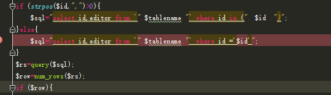
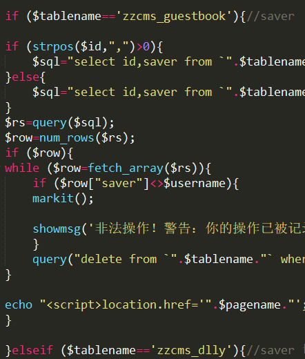
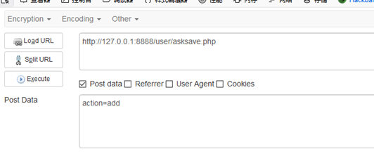
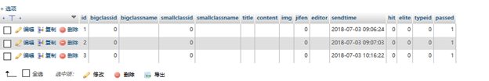
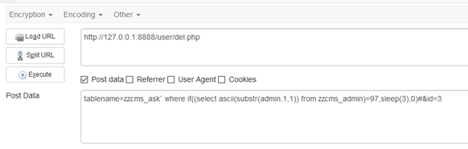
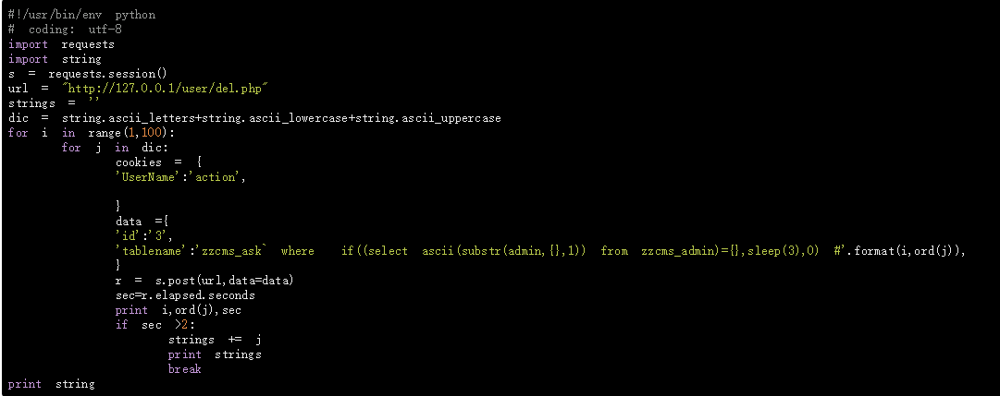

# user/del.php
Edition: zzcms8.3 user/del.php

# 0x01 Injection point

Although the website adds the addslashes function to the request parameters for filtering, it can only be injected with an anti-apostrophe.

The parameter tablename can be injected by closing the back apostrophe, but first insert information into the data table, then you can use the select delay to inject the admin password, and the injected table is not empty.

# 0x02 Insert data into zzcms_ask

The previous execution flow is controlled by if

Select the selector parameter at the injection point, so you need to use the zzcms_ask table for injection.

# 0x03 Delay injection

