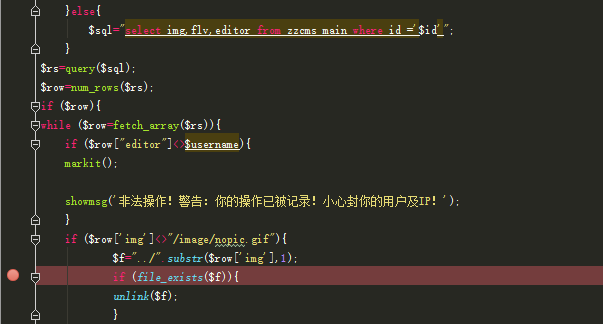
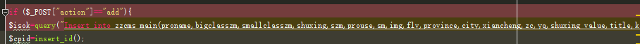
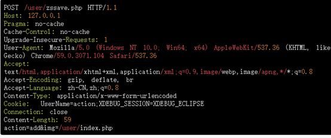
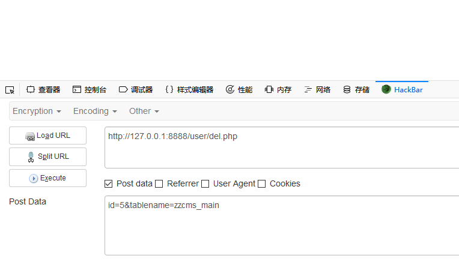
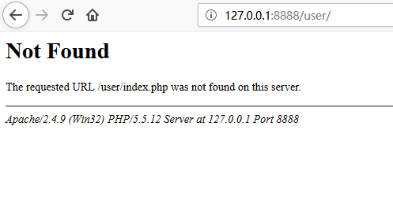

# user/del.php
Edition:
zzcms8.3
user/del.php

# 0x01  Vulnerability 

There is unlink($f) to delete any file by controlling the value of $f

# 0x02 Control $f

This variable is obtained by querying the img path in the zzcms_main data table.
So first write the relative path to the file to be deleted in the zzcms_main table.

# 0x03 Insert data into zzcms_main
Code positions to user/zssave.php

Payload is as follows, directly post action=add&img=/user/index.php

# 0x04 Delete Files

This requires a burst of id (id value can be blown)

delete  user/index.php successfully
